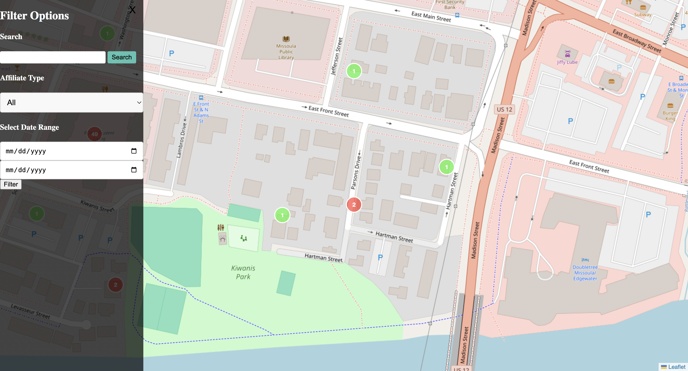

 # Project README

 ## Overview
 This project is a web application that displays an interactive map with markers representing different properties. Users can filter, search, and view detailed information about each property.

 ## Key Features
 - **Interactive Map**: Allows users to interact with property markers.
 - **Property Sidebar**: Displays detailed information about selected properties.
 - **Search and Filter**: Enables users to search for properties by address and filter by type.

 

 ## Code Structure
 - **JQuery Map Script**: Interactive leaflet map (static/js/map.js).
 - **CSS Styles**: Styles for the application (static/css/styles.css).
 - **Server-side Code**: Python code for server-side operations (flask_server.py).

 ## Running the Project
 1. Install all necessary dependencies (React, Leaflet, Flask).
 2. Start the Flask server by running flask_server.py. The server will start on localhost:5000.
 3. Open a web browser and navigate to localhost:5000 to view the application.

 ## Future Improvements
 - **Improved Search**: Enhance search functionality to support complex queries.
 - **Additional Filters**: Add more filters for better property selection.
 - **Performance Optimizations**: Optimize the application to handle larger datasets.
 - **User Interface Enhancements**: Improve the user interface for better user experience.
